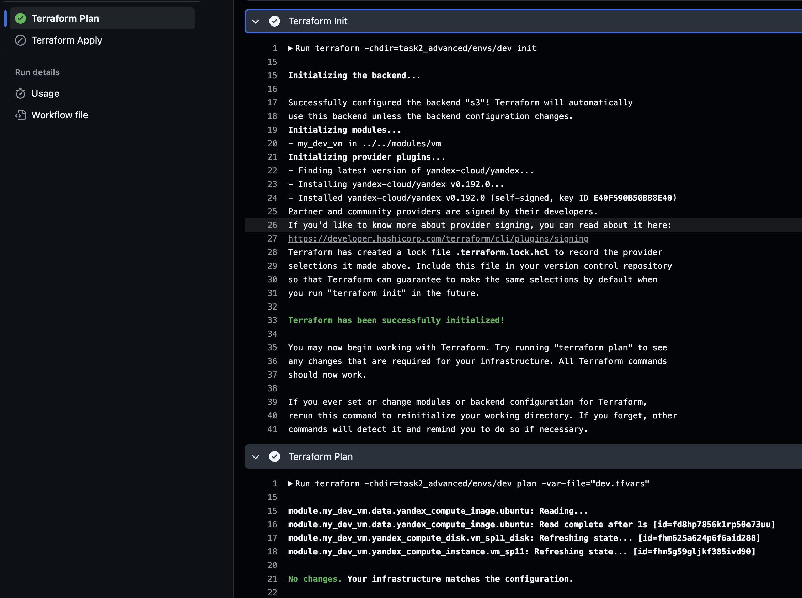
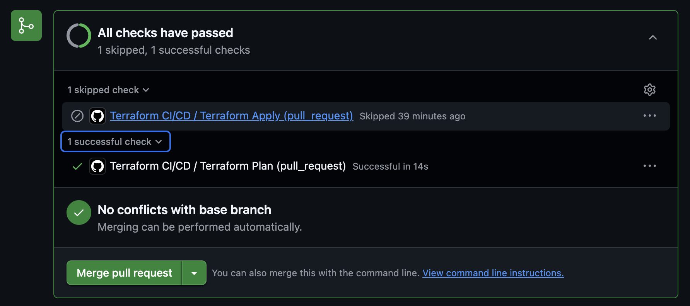
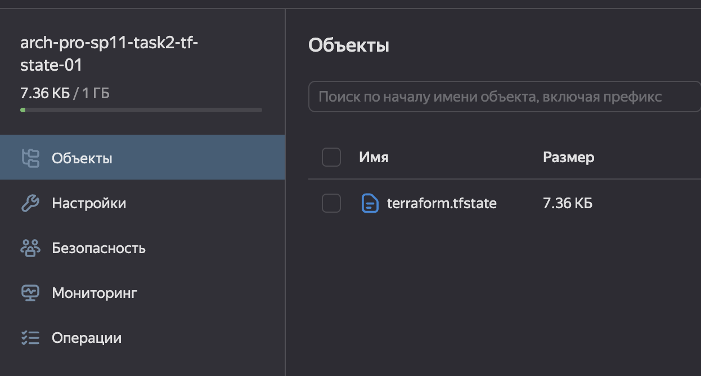

## Задание 2. Интеграция с CI/CD и удалённым хранением состояния
>
>Автоматизируйте развёртывание инфраструктуры через CI/CD, используя удалённое состояние (S3/Minio + backend). Конкретный инструмент для CI/CD не принципиален — вы можете реализовать задачу на Jenkins или в любой другой системе, которая вам ближе и привычнее по опыту.
>
>**Для этого:**
>
>1. Настройте Terraform-код с backend’ом с использованием S3-совместимого хранилища (minio, Yandex Object Storage, AWS S3).
>2. Опишите pipeline с использованием `.gitlab-ci.yml` или GitHub Actions или другого CI/CD-инструмента:
>    * `terraform init`
>    * `terraform plan`
>    * `terraform apply` (по кнопке или с флагом approval)
>
>
>**README.md** опишет детально все скрипты.
>
>Когда задание будет готово, загрузите Terraform-код с backend’ом в директорию **Task2Advanced** в рамках пул-реквеста.
>
>Обратите внимание, что ревьюер будет оценивать логику CI/CD-пайплайна, включая вопросы безопасности, изоляции и использование переменных, а также проверять, что состояние не хранится локально.

---

## Инициализация конфига Terraform с загрузкой в S3 для dev окружения
Для примера рассматриваем только dev-окружение.
1. Создание бакета S3 через `yc cli` в Yandex Cloud:
   ```shell
   yc storage bucket create \
     --name arch-pro-sp11-task2-tf-state-01 \
     --max-size 1073741824 \
     --default-storage-class standard  
   ```
2. Создание кредов для доступа к S3 `yc iam access-key create --service-account-name sa-terraform-sp11`; результаты сохранить в `.env.secrets`:
    ```shell
      sa-terraform-sp11.key_id=<<your_key_id>>
      sa-terraform-sp11.secret=<<your_key_secret>>
    ```
3. Локальная проверка загрузки state в s3. Здесь и далее команды из `task2_advanced/`. .  
- В новом окне терминала загрузить переменные окружения, которые должны подтянуться автоматом при выполнении команд `terraform`. При необходимости надо создать подсеть, подсеть должна совпадать с зоной:
   ```shell
      # создаем временный токен для доступа
      export YC_TOKEN=$(yc iam create-token)
      export YC_CLOUD_ID=$(yc config get cloud-id)
      export YC_FOLDER_ID=$(yc config get folder-id)
      export YC_ZONE=<<your_zone>>
   
      # закинуть в переменную созданный публичный ключ из файла
      export TF_VAR_zone=<<your_zone>>
      export TF_VAR_subnet_id=<<your_subnet_id>>
      export TF_VAR_ssh_pub_key=$(cat ~/.ssh/yc_id_rsa.pub)
   
      export AWS_ACCESS_KEY_ID=$(grep "sa-terraform-sp11.key_id" .env.secrets | cut -d'=' -f2)
      export AWS_SECRET_ACCESS_KEY=$(grep "sa-terraform-sp11.secret" .env.secrets | cut -d'=' -f2)
   ```
- Инициализация: `terraform -chdir=envs/dev init`.
- План (указываем путь к `.tfvars` относительно папки `envs/dev`): `terraform -chdir=envs/dev plan -var-file="dev.tfvars"`.
- Применение:
   ```sh
     terraform -chdir=envs/dev apply -var-file="dev.tfvars"
   
     # проверка загрузки файла стейта в S3
     yc storage s3api list-objects --bucket arch-pro-sp11-task2-tf-state-01
     contents:
     - key: dev/terraform.tfstate
       last_modified: "2026-03-17T12:49:28.349Z"
       etag: '"4b1a6.........."'
       size: "7535"
       owner:
          id: aje......
          display_name: aje........
       storage_class: STANDARD
       name: arch-pro-sp11-task2-tf-state-01
       max_keys: "1000"
       key_count: "1"
       request_id: 0156........
   ```
- Удалить ресурсы `terraform -chdir=envs/dev destroy -var-file="dev.tfvars"`.
4. Настройка пайплайна terraform через github actions.
- добавлен конфиг [terraform.yml](../.github/workflows/terraform.yml);
  - джоба `terraform-plan` при обновлениях в ПР;
  - джоба `terraform-apply` в ветке `main` по кнопке, если успешен `terraform-plan`;
- добавлены секреты в репозиторий GitHub:
    ```yml
        YC_TOKEN: ${{ secrets.YC_IAM_TOKEN }}
        YC_CLOUD_ID: ${{ secrets.YC_CLOUD_ID }}
        YC_FOLDER_ID: ${{ secrets.YC_FOLDER_ID }}
        YC_ZONE: ${{ secrets.YC_ZONE }}
        TF_VAR_zone: ${{ secrets.YC_ZONE }}
        TF_VAR_subnet_id: ${{ secrets.YC_SUBNET_ID }}
        TF_VAR_ssh_pub_key: ${{ secrets.YC_SSH_PUB_KEY }}
        AWS_ACCESS_KEY_ID: ${{ secrets.YA_CLOUD_S3_BUCKET_SP11_KEY_ID }}
        AWS_SECRET_ACCESS_KEY: ${{ secrets.YA_CLOUD_S3_BUCKET_SP11_ACCESS_KEY }}
    ```
5. Результаты:
- 
- 
- 

