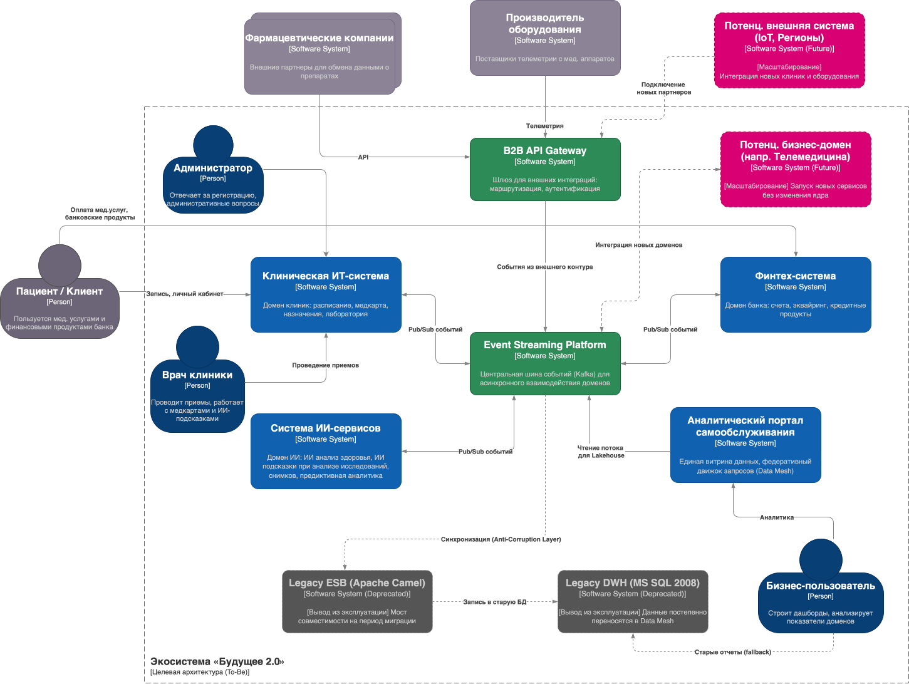
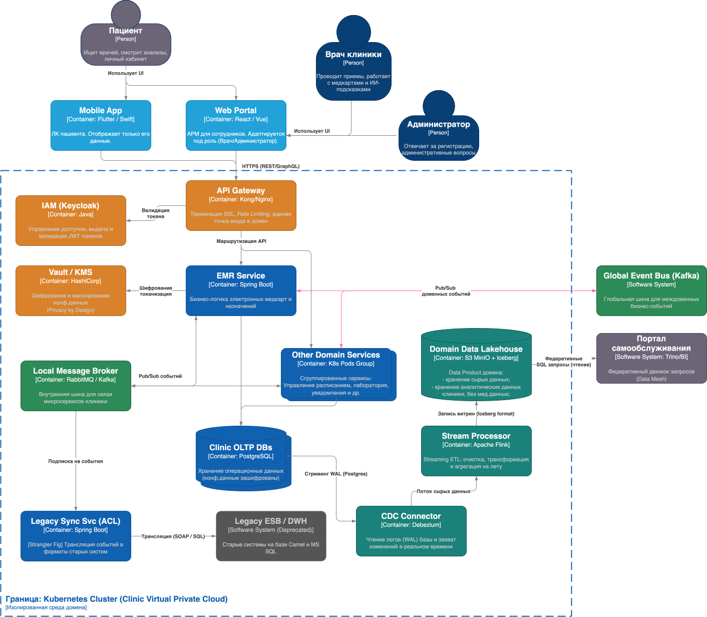
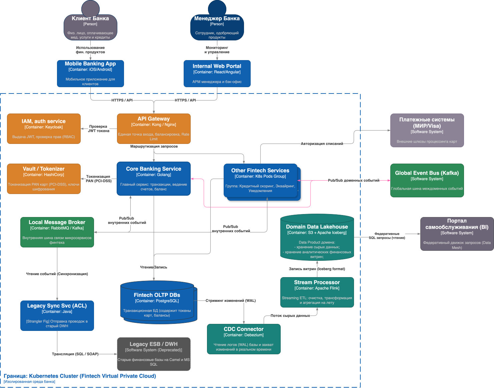
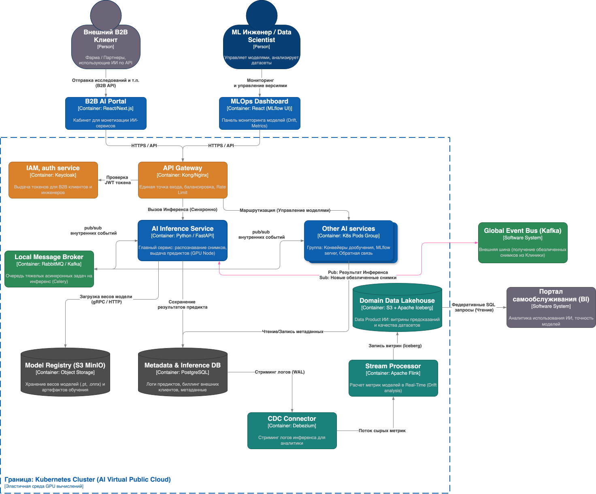
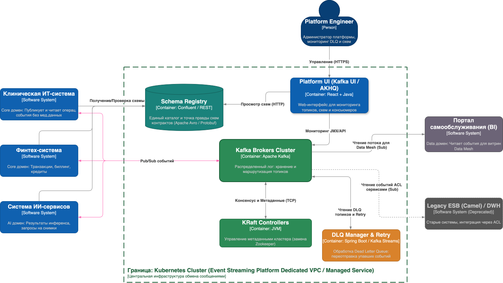
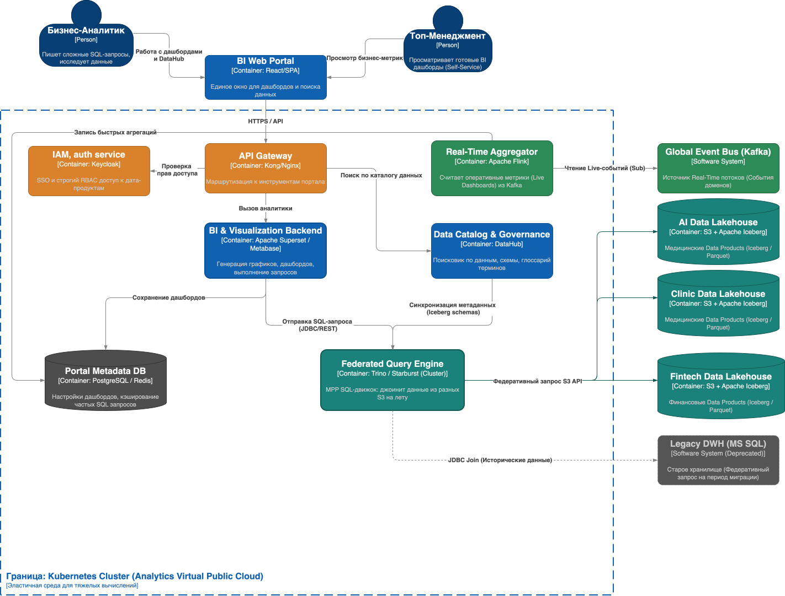
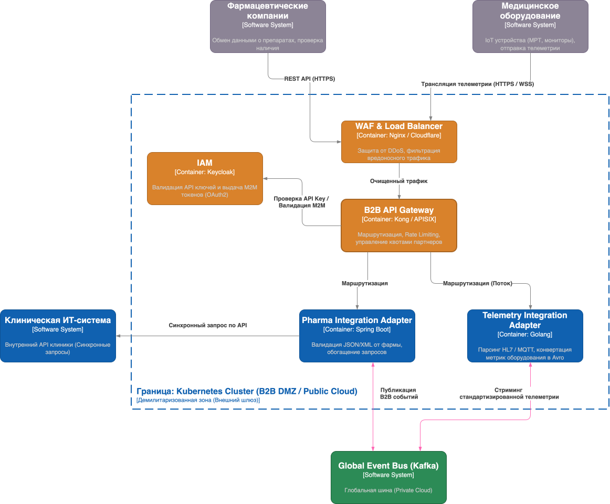

>## Задание 3. Проектирование целевой архитектуры и оценка рисков внедрения
>
>1. Спроектируйте целевую архитектуру системы «Будущего 2.0» в горизонте трёх лет, используя C4-модель на уровне контейнеров и компонентов. Покажите, как изменятся ключевые системы компании при масштабировании, включая появление новых бизнес-направлений, интеграцию дополнительных источников данных и отказ от легаси-систем.
>2. Составьте карту рисков трансформации, определив архитектурные, организационные и технологические риски. Для каждого риска укажите вероятность его возникновения (низкая, средняя, высокая) и потенциальное влияние на бизнес (низкое, среднее, высокое).
>3. Предложите план управления рисками, описав конкретные меры по их снижению. Укажите, какие риски можно минимизировать с помощью технических решений, а какие — управленческими подходами.
>
>Когда задание будет готово, загрузите C4-диаграмму, карту рисков и план управления в директорию **Task3Advanced** в рамках пул-реквеста.
>
---

## Часть 1. Подготовительные шаги
### Контекст
- Важно отметить, что бизнесу Будушего 2.0 предстоит **МАСШТАБНАЯ** трансформация на горизонте 3 лет, для которого требуется нарисовать C4-диаграммы.
- Вероятно в задании ошибка, и нужно нарисовать диаграммы С4 уровней L1 и L2, а не L2 и L3. Потому что проработка уровня L3 С4 (компоненты) для системы, где есть только описание направлений бизнесов, но нет даже подробных требований, кажется, невозможно сделать за разумное время в рамках учебного проекта.
- Для таких масштабных трансформаций нужен какой-то верхнеуровневый подход для проработки архитектуры. Вроде бы можно использовать такие облегченные подходы из Enterprise Architecture как `TOGAF` или метод `Attribute-Driven Design (ADD)`.
- Наверное, мы должны смотреть на систему "сверху вниз" глазами **Enterprise/Solution-архитектора**: на данном этапе нас итересует в первую очередь **инфраструктура, топология и интеграционные паттерны**.
- На основании вышесказанного пайплайн анализа до того, как мы начнем рисовать схемы, может выглядеть следующим образом:

### Анализ Enterprise Architecture
1. **Бизнес-драйверы и цели (Business Goals):** 
   - _Выписать то, ради чего всё затевается_. Из кейса мы видим: 
     - масштабирование (по продуктам и в новые регионы);
     - **независимость** бизнес-юнитов: возможность развивать и релизить медицинские, финтех- и ИИ-сервисы в своем темпе, не блокируя друг друга.
     - переход к near-real-time аналитике;
     - изоляция доменов для ускорения time-to-market; 
     - а также создание портала самообслуживания по всем бизнес-юнитам для бизнес-пользователей.
2. **Ключевые архитектурные характеристики (Architectural Quanta / Ilities):** 
   - _Исходя из бизнес-целей, мы определяем, что система должна обладать_:
     - **Слабой связностью (Loose Coupling)**: ключевая характеристика для обеспечения независимости команд и доменов
     - **Масштабируемостью (Scalability)** — для выхода в новые регионы.
     - **Изолированностью (Fault Tolerance / Bulkhead)** — авария в одном домене не должна класть остальные.
     - **Безопасностью/Комплаенсом (Security/Privacy)** — строгие требования к обработке медицинских и финансовых данных.
     - **Гибкостью развертывания (Deployability)** — для независимого развития бизнес-направлений.
3. **Ограничения (Constraints):** 
   - У нас есть тяжелое легаси: монолитный DWH на MS SQL 2008, интерфейсы операторов на PowerBuilder и синхронная шина ESB на базе Apache Camel. 
   - Их придется использовать как «мосты совместимости» на переходный период, постепенно вытесняя паттерном Strangler Fig.
4. **Domain Discovery (Верхнеуровневый черновик):** 
   - Отличная методология для этого на старте — `Event Storming`. Так как целевая архитектура должна стать реактивной и опираться на события, `Event Storming` позволит выявить ключевые доменные события (например, `ПациентЗаписан`, `СчетОплачен`, `ДиагнозПоставлен`).
   - Однако почему то `Event Storming` - это следующее Задание 4. Поэтому в этом задании 3 покажем крупными мазками основные системы-участники (Медицина, Финтех, ИИ, Аналитика) на основании деления по бизнесам;

---

## Часть 2. Анализ уровней L1 и L2 С4 на основании доменов DDD

| Тип | Бизнес-направление (Домен)    | Поддомены (Bounded Contexts) | C4 Уровень 1 (System) | C4 Уровень 2 (примеры контейнеров)                                             | Обоснования                                                                                                                           |
| --- |-------------------------------| --- | --- |--------------------------------------------------------------------------------|---------------------------------------------------------------------------------------------------------------------------------------|
| **Бизнес** | **Медицина (Core)**           | - Расписание  - Электронная медкарта  - Лаборатория | **Клиническая ИТ-система** | - Сервис расписания  - Сервис медкарт  - БД клиник (Private Cloud) | Содержит медицинские карты и снимки, которые изолируются от общей аналитики.                                                          |
| **Бизнес** | **Финансы (Core)**            | - Счета и эквайринг  - Карты и вклады  - Кредитование | **Финтех-система (Банк)** | - Кредитный модуль (Golang/Java)  - Модуль счетов  - Финансовая БД | Новое направление: компания купила банк. Работает с фин. тайной.                                                                      |
| **Бизнес** | **ИИ (Core)**                 | - Распознавание снимков  - Предиктивная аналитика | **Система ИИ-сервисов** | - Сервисы ML-инференса (Python)  - Объектное хранилище (S3)              | Выделенная компания, предоставляющая ИИ-сервисы.                                                                                      |
| **Платформа** | **Событийная шина (Tech)**    | - Маршрутизация событий  - Гарантированная доставка | **Event Streaming Platform** | - Кластер Kafka  - Schema Registry  - DLQ (Dead Letter Queue)      | Требование бизнеса: переход к слабосвязанной событийной платформе и асинхронным потокам.                                              |
| **Платформа** | **Аналитика (Data)**          | - Каталог данных  - Федеративный запрос  - Визуализация (BI) | **Аналитический портал самообслуживания** | - BI UI  - Движок запросов (Trino)  - DataHub (Каталог схем)       | Бизнес-цель: создание витрины данных для получения отчетов без медицинских карт.                                                      |
| **Платформа** | **Внешние интеграции (Tech)** | - B2B шлюз  - Антикоррупционный слой | **B2B API Gateway** | - API Gateway  - Адаптеры для старой ESB                                 | - Необходима интеграция с фармкомпаниями и производителями оборудования.  - Сохранение старой шины Camel как моста совместимости. |

---

---

## Часть 3. Подготовка схем С4 L1 и L2

### 3.1 ADR-01: долгосрочные архитектурные решения системы «Будущее 2.0»
1. Событийно-ориентированная архитектура (EDA) с двухуровневой топологией
   - **Решение:** Взаимодействие между доменами строится на базе асинхронного обмена событиями. Применяется двухуровневая топология брокеров:
     - **Local Message Broker (RabbitMQ / Kafka):** Разворачивается внутри каждого контура K8s для внутренних нужд микросервисов домена.
     - **Global Event Bus (Kafka):** Выделенный центральный кластер для обмена значимыми бизнес-событиями (Data Contracts) между изолированными доменами.
2. Стратегия развертывания — Гибридное облако (Hybrid Cloud)
   - **Решение:** Системы распределяются между приватным и публичным контурами в зависимости от критичности данных и требуемой эластичности:
     * **Private Cloud (On-Premise):** Медицинский и Финансовый домены (хранение PII, PCI-DSS, коммерческой тайны), Vault, ядро платформы.
     * **Public Cloud:** Аналитический портал (эластичные вычисления для тяжелых SQL-запросов), ИИ-сервисы (потребность в GPU, работа с обезличенными данными) и B2B Gateway (DMZ для внешнего трафика).
3. Архитектура данных — Data Mesh и Streaming ETL
   - **Решение:** Отказ от централизованного монолитного DWH и ночных батч-загрузок.
     - Каждый Core-домен владеет собственным Data Product (озером данных) на базе **S3 + Apache Iceberg**.
     - Наполнение витрин происходит в режиме near-real-time через потоковый конвейер: **CDC (Debezium) -> Stream Processor (Apache Flink) -> S3**.
4. Аналитика — Федеративный движок запросов
   - **Решение:** Вместо физического копирования петабайтов данных в единое хранилище внедряется **Federated Query Engine (Trino)**. Аналитические запросы исполняются децентрализованно: движок по S3 API читает данные напрямую из доменных Data Lakehouse (Медицины, Финансов, ИИ) и объединяет их в оперативной памяти кластера аналитики. Для поиска витрин внедряется Data Catalog (DataHub/Amundsen).
5. Безопасность — Privacy by Design
   - **Решение:** Для выполнения требований 152-ФЗ внедряется обязательная токенизация и шифрование критичных данных до их записи в хранилища. Бизнес-сервисы интегрируются с **HashiCorp Vault / KMS**. В OLTP базах данных (PostgreSQL) хранятся только зашифрованные значения или токены (PAN-карт, ФИО пациентов).
6. Миграция — Изоляция легаси через паттерн Strangler Fig
   - **Решение:** Старые системы (Legacy DWH на MS SQL и ESB на Camel) сохраняются на переходный период (1.5–2 года). Взаимодействие с ними осуществляется строго через выделенные **Anti-Corruption Layer (ACL)** сервисы. ACL-сервисы подписываются на события в шине и транслируют их в старые форматы (SOAP/SQL), защищая новый микросервисный код от влияния легаси.
7. Управление контрактами — Schema Registry
   - **Решение:** Публикация событий в Global Event Bus разрешена только с использованием строгой типизации (Apache Avro или Protobuf). Контроль версий контрактов и совместимости обеспечивается центральным компонентом **Schema Registry**, что исключает поломку потребителей (Аналитики, других доменов) при изменении структур данных отправителем.
8. Внешние интеграции — Выделенный B2B Gateway (DMZ)
   - **Решение:** Для интеграции с внешним миром (Фармацевтические партнеры, IoT-телеметрия медицинского оборудования) создается изолированный домен в публичном облаке. Он терминирует внешний трафик, проверяет M2M-авторизацию (через IAM/Keycloak) и использует сервисы-адаптеры для перевода внешних протоколов (HL7, MQTT, сторонние REST API) во внутренний стандарт корпоративных событий.

---

### 3.2 Схема С4 L1

---

### 3.3 Схемы С4 L2

---

## Часть 4: Карта рисков трансформации

| ID | Категория | Описание риска | Вероятность | Влияние |
| :--- | :--- | :--- | :--- | :--- |
| **A1** | **Архитектурный** | **Нарушение консистентности данных (Eventual Consistency).** В распределенной среде данные в медицинском и финансовом контурах могут временно рассинхронизироваться из-за задержек в шине событий. | Средняя | Высокое |
| **A2** | **Архитектурный** | **Ошибки в границах доменов.** Неправильное выделение Bounded Contexts приведет к высокой связности (chatty microservices) и излишнему междоменному трафику через глобальную Kafka. | Средняя | Высокое |
| **A3** | **Архитектурный** | **Узкое горлышко в API Gateway или Kafka.** При резком росте нагрузки (например, массированный стриминг снимков или IoT-телеметрии) центральные узлы могут не справиться. | Низкая | Высокое |
| **O1** | **Организационный** | **Нехватка компетенций в новых технологиях.** У текущей команды нет или мало опыта работы с Kafka, Apache Flink, Iceberg, Trino и K8s. | Высокая | Высокое |
| **O2** | **Организационный** | **Сопротивление изменениям со стороны врачей и операторов.** Переход со старого, привычного интерфейса PowerBuilder на новые Web/Mobile UI вызовет отторжение и снижение скорости работы на первых этапах. | Высокая | Среднее |
| **O3** | **Организационный** | **Размытие ответственности за данные (Data Ownership).** В парадигме Data Mesh команды доменов могут отказаться поддерживать качество своих витрин (Data Products) для внешних потребителей. | Средняя | Высокое |
| **T1** | **Технологический** | **Проблемы интеграции с Legacy (DWH / Camel).** Слой Anti-Corruption Layer (ACL) не сможет обеспечить нужную пропускную способность для двунаправленной синхронизации старых и новых систем на переходный период. | Средняя | Среднее |
| **T2** | **Технологический** | **Утечка ПДн и карточных данных.** Сложности настройки ИБ в гибридном облаке могут привести к компрометации защищенного контура при доступе из публичного облака (BI-портал, ИИ-модели). | Низкая | Высокое |
| **T3** | **Технологический** | **Сетевые задержки (Latency) между ЦОД и облаком.** Федеративные запросы Trino из Public Cloud в S3 Private Cloud могут работать медленнее ожидаемого из-за физической дистанции. | Средняя | Среднее |

---

## Часть 5: План управления рисками

Для минимизации описанных рисков применяется комбинация технических паттернов и административных (управленческих) мер.

### 5.1. Технические меры
* **Гарантия доставки и консистентности (Снижает A1, T1):**
    * Внедрение паттерна **Transactional Outbox** внутри микросервисов для надежной публикации событий в локальную шину.
    * Реализация **Dead Letter Queue (DLQ)** и автоматических Retry-механизмов для обработки сбоев при чтении из Kafka.
* **Управление контрактами и трафиком (Снижает A2, A3):**
    * Обязательное использование **Schema Registry** (Avro/Protobuf) для всех событий в глобальной шине. Ломающие изменения схем блокируются на уровне CI/CD.
    * Настройка **Rate Limiting** и квотирования на B2B API Gateway для защиты от перегрузок со стороны IoT-оборудования и партнеров (Фарма).
* **Информационная безопасность (Privacy by Design) (Снижает T2):**
    * Внедрение **HashiCorp Vault** для токенизации PAN-карт (PCI-DSS) и маскирования ФИО пациентов до записи в базы данных.
    * Настройка защищенного сетевого туннеля (VPC Peering / AWS Direct Connect / Yandex Cloud Interconnect) между приватным ЦОД и публичным облаком. Никаких публичных IP для баз данных.
* **Изоляция Legacy (Снижает T1):**
    * Плавное переключение трафика по паттерну **Strangler Fig** с использованием канареечных релизов (Canary Releases) на API Gateway (например, 5% трафика идет в новые сервисы, 95% — в старую шину Camel).

### 5.2. Управленческие подходы
* **Развитие команды и найм (Снижает O1):**
    * Запуск программы внутреннего обучения до старта разработки 2-го этапа.
    * Усиление команды за счет найма опытных Platform/Data Engineers, которые создадут базовые шаблоны инфраструктуры (Helm charts, Terraform), чтобы продуктовые команды не изобретали велосипед.
* **Change Management и работа с пользователями (Снижает O2):**
    * Привлечение ключевых врачей и операторов (амбассадоров изменений) на этап проектирования новых интерфейсов (UX/UI).
    * Поэтапный отказ от старых интерфейсов: на первых этапах новый функционал работает параллельно со старым (через двустороннюю синхронизацию в слое ACL).
* **Управление данными и архитектурой (Снижает A2, O3):**
    * Создание **Архитектурного комитета**, который валидирует границы доменов и схемы событий до старта разработки.
    * Внедрение ролей **Data Stewards (Владельцев данных)** в каждом core домене (Клиника, Финтех, ИИ). Эти люди несут бизнес-ответственность за качество, документацию и SLA своих витрин в рамках архитектуры Data Mesh (закрепляется в KPI).

---