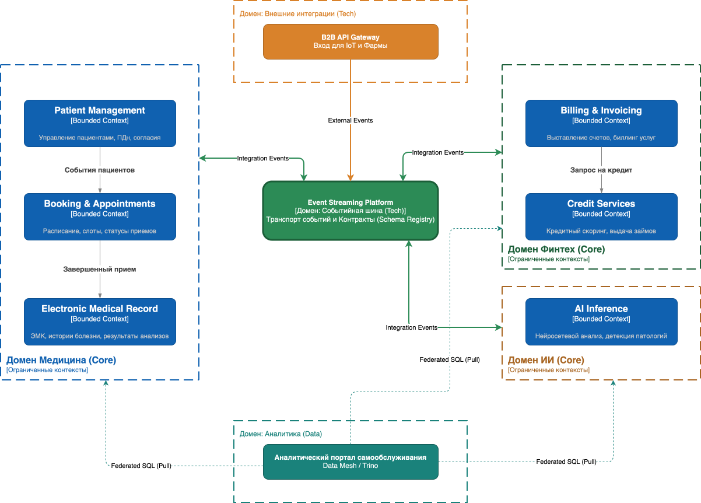
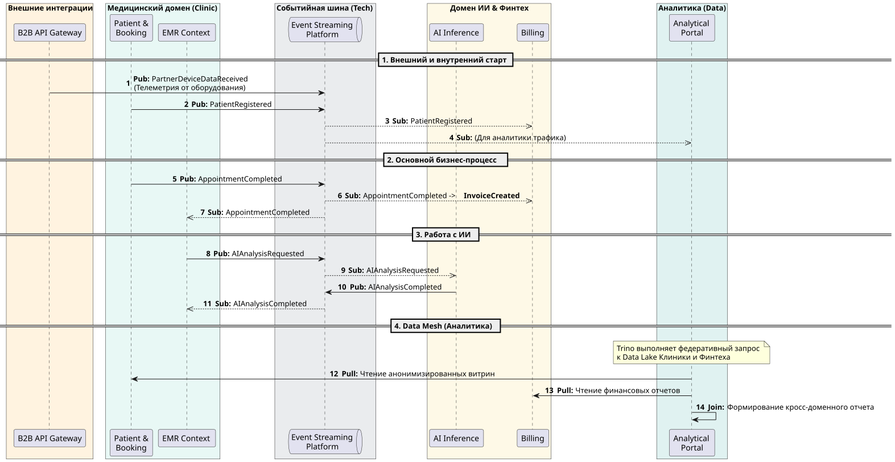

## Задание 4. Моделирование домена и интеграций
>
>1. Разделите систему на домены с использованием подхода Domain-Driven Design (DDD). Определите **bounded contexts** для каждого домена и опишите ключевые агрегаты и события, которые будут играть важную роль при взаимодействии между доменами.
>2. Опишите целевую событийную архитектуру, построив **Event Storming-диаграмму** или аналогичную схему. На диаграмме отразите основные события, публикуемые доменами. Например: «Создан кредитный договор», «Зарегистрирован новый пациент» или «Пройдено исследование ИИ». Укажите, какие домены выступают источниками этих событий, а какие — подписчиками.
>3. Обоснуйте выбор событийного подхода, пояснив, какие преимущества он принесёт компании «Будущее 2.0». Опишите, как переход на интеграцию через события повысит гибкость, масштабируемость и скорость реакции системы по сравнению с текущей шиной Camel и DWH.
>
>Когда задание будет готово, загрузите схему bounded contexts, Event Storming и аргументацию в директорию **Task4Advanced** в рамках пул-реквеста.
>
>**Обратите внимание, что в репозитории есть директория /Task4Advanced/ с артефактами:**
>
>* `bounded-contexts.*` — схема bounded contexts (PNG/PDF/MD/PlantUML/Mermaid/Miro export).
>* `event-storming.*` — Event Storming (или эквивалентная событийная схема).
>* `aggregates.md` — описание агрегатов (границы, инварианты, ключи).
>* `events.md` — каталог доменных событий (название, контекст-источник, семантика, минимальный контракт).
>* `justification.md` — обоснование событийного подхода vs Camel/DWH.

## Общее обоснование доменных границ и событийной модели «Будущее 2.0» с помощью EventStorming

Стратегия **EventStorming** — выписать все значимые бизнес-события систем «на одну стену», не привязываясь к текущим командам или серверам. В теории это позволит увидеть «естественные» границы подсистем, а не те, что продиктованы другими соображениями, например, старым легаси-кодом.

## 1. Выявление границ доменов (Bounded Contexts)
В процессе выбора доменов (Bounded contexts) следует опираться на два ключевых признака «здоровой» архитектуры:
- Лингвистические барьеры (Единый язык — Ubiquitous Language);
- Связанность потоков данных (Data Coupling)

### 1.1. Лингвистические барьеры

#### Бизнес-слой
Ключевые понятия системы имеют принципиально разный смысл в разных бизнес-юнитах Будущего 2.0.
* **Клиент (Patient vs. Bank Customer):** 
  * **В медицине:** Это «Пациент». Здесь фокус на биологических данных: группа крови, история болезней, аллергии.
  * **В финтехе:** Это «Клиент банка». Здесь фокус на финансовых метриках: кредитный лимит, история транзакций, KYC-статус (знай своего клиента).
  * В ИИ: Это «Объект анализа» или «Сэмпл». Личность человека здесь — это «шум», который должен быть удален. ИИ работает с обезличенными признаками (тензорами), а не с именами.
* **Событие «Исследование» (Medical Study vs. AI Task):**
    * Для врача это процесс диагностики. 
    * Для ИИ-домена это «Задача на инференс» (входящая очередь на GPU). 
    * Лингвистический переход от «снимка пациента» к «входному тензору модели» — это четкая граница Bounded Context.
* **Вывод**: Выделить бизнес-домены **Медицина**, **Финтех** и **ИИ**.

#### Технический-слой
Если применить принцип Ubiquitous Language к техническому слою, можно заметить, что терминология там в корне отличается от того, что понимают врачи или банкиры:
* **Событие** (предполагаемый домен **Событийная шина** vs **Медицина**):
    * Здесь **Событие** — это не поход пациента к врачу. Для инженера этого домена это технический пакет данных со своим «смещением» (offset), «партицией» (partition) и «схемой» (schema). 
    * Бизнес-аналитик говорит о «визите», а техник домена — о `at-least-once delivery` и `retention policy`. Это два разных языка.
* **Данные** (предполагаемый домен **Аналитический портал самообслуживания** vs **Медицина** vs **ИИ**):
    * Здесь данные превращаются в **«Дата-продукты» (Data Products)**. 
    * Язык домена — это `federated query` (федеративный запрос), `query plan` и `pushdown`. 
    * Для аналитика этого домена данные пациента или анализ снимка — это не медкарта и не текстовый документ, а массив в формате Parquet или таблица в Iceberg, которую нужно эффективно «сджоинить».
* **Интеграция** (предполагаемый Домен **Внешние интеграции** vs бизнес домены):
    * Слово **«Интеграция»** для бизнеса — это партнерство с фарм-компанией. 
    * Для этого тех-домена это `API Key`, `Rate Limit`, `Circuit Breaker` и `Protocol Transformation`. 
    * Здесь говорят на языке безопасности периметра и пропускной способности каналов.

- **Вывод**: обоснован выбор технических доменов:
  - **Событийная шина (Event Streaming Platform)**;
  - **Аналитический портал самообслуживания**;
  - **Внешние интеграции (B2B API Gateway)**

### 2. Анализ потоков данных
- Кажется, что бизнес-события естественным образом группируются в «острова» с высокой плотностью взаимодействия. 
- Внутри каждого острова события связаны очень тесно, но между самими островами связей крайне мало. Это позволило нам определить оптимальные границы доменов.

Внутри каждого домена живут десятки **внутренних (Internal)** событий, необходимых для оркестрации сервисов. Однако наружу, в глобальную шину Kafka, можно вынести только единичные **интеграционные (Integration)** события-триггеры.

**Распределение событий по доменам:**

* **Домен «Медицина» (Clinic):**
    * *Внутренняя жизнь (десятки событий):* `SlotReserved` (Слот забронирован), `DoctorScheduleUpdated` (Расписание обновлено), `PatientCheckedIn` (Пациент пришел в клинику), `LabTestOrdered` (Назначен анализ), `MedicalNoteDrafted` (Черновик записи создан). Эти события важны только для координации врачей и ресурсов внутри клиники.
    * *Выход в глобальную шину:* Всего два ключевых факта — **`PatientRegistered`** и **`AppointmentCompleted`**.
* **Домен «Финтех» (Bank):**
    * *Внутренняя жизнь (десятки событий):* `TransactionValidated` (Транзакция проверена), `CreditScoreCalculated` (Скоринг рассчитан), `CurrencyRateFetched` (Курс валют получен), `AccountLinked` (Счет привязан), `CashbackCalculated` (Кэшбэк начислен). Это чисто банковская «кухня», которая не интересна врачам.
    * *Выход в глобальную шину:* Только финансовые итоги — **`InvoiceCreated`** и **`InvoicePaid`**.
* **Домен «ИИ» (AI):**
    * *Внутренняя жизнь (десятки событий):* `DatasetPreprocessed` (Данные подготовлены), `ModelTrainingStarted` (Обучение запущено), `InferenceTaskQueued` (Задача на анализ в очереди), `GPUNodeAllocated` (Выделены ресурсы GPU). Это технические процессы обработки данных в облаке.
    * *Выход в глобальную шину:* Только результат работы — **`AIAnalysisCompleted`**.
* **Домен «Событийная шина» (Tech):**
    * *Внутренняя жизнь (сотни событий):* `TopicCreated`, `LeaderElected`, `PartitionBalanced`, `SchemaValidated`. Это технический шум, который критичен для работы платформы, но абсолютно бесполезен для Финтеха или Клиники.
    * *Связь с миром:* Этот домен является «клеем», он не порождает свои бизнес-события, но гарантирует доставку чужих.
* **Домен «Аналитика» (Data):**
    * *Внутренняя жизнь (десятки событий):* `MetadataRefreshed`, `QueryFragmentScheduled`, `CacheMissed`. Эти события обеспечивают работу Trino и выполнение федеративных запросов к разным доменным Data Lake (на S3).
    * *Связь с миром:* Аналитика «молчит», пока её не спросят. Она потребляет события всех доменов, чтобы построить общую картину.
* **Домен «Внешние интеграции» (Tech):**
    * *Внутренняя жизнь (десятки событий):* `ApiKeyValidated`, `RequestThrottled`, `HeaderInjected`, `BackendTimeoutOccurred`.
    * *Связь с миром:* Выступает фильтром. В глобальную шину долетают только «очищенные» данные от внешних партнеров (например, телеметрия оборудования).

**Результат:** Такие домены позволяют заложить в архитектуре **слабую связность (Loose Coupling)**.

### 3. Модель междоменного взаимодействия
На основе выбраных границ рассмотрим 6 ключевых **Integration Events** (Интеграционных событий), которые станут «контрактом» между нашими доменами в глобальной Kafka:
1.  **`PatientRegistered`** (Медицина -> Финтех): Сигнал банку открыть счет новому клиенту.
2.  **`AppointmentCompleted`** (Медицина -> Финтех): Команда биллингу выставить счет за услуги.
3.  **`AIAnalysisRequested`** (Медицина -> ИИ): Передача анонимных данных на GPU-кластер для инференса.
4.  **`AIAnalysisCompleted`** (ИИ -> Медицина): Возврат предикта в медицинскую карту.
5.  **`InvoiceCreated`** (Финтех -> Медицина): Сообщение о готовности счета для пациента.
6.  **`InvoicePaid`** (Финтех -> Медицина): Сигнал медицине, что услуги оплачены и можно открыть доступ к результатам.

### 4. Навигация по артефактам
Для детального погружения в реализацию используйте следующие документы:
* [bounded_contexts.drawio.xml](bounded_contexts.drawio.xml): визуальное разделение контекстов:

* [event-storming.puml](event-storming.puml): потоковая диаграмма, показывающая, как события обеспечивают работу сквозных бизнес-процессов через новую событийную шину.

* [events.md](events.md): каталог доменных событий (Event Registry).
* [aggregates.md](aggregates.md): описание некоторых ключевых агрегатов доменов (Patient, Appointment, AI Analysis, Invoice).
* [justification.md](justification.md): подробное обоснование, почему EDA лучше на масштабировании по сравнению со старой шиной Camel.

---